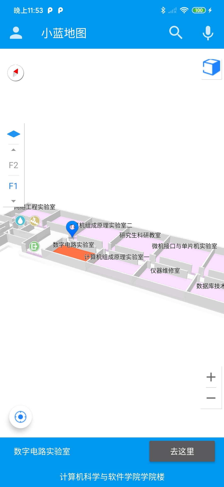
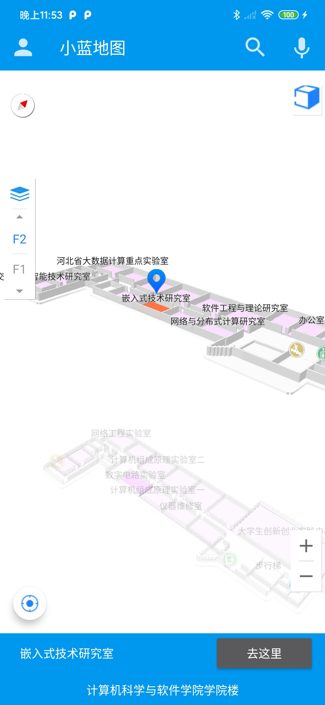
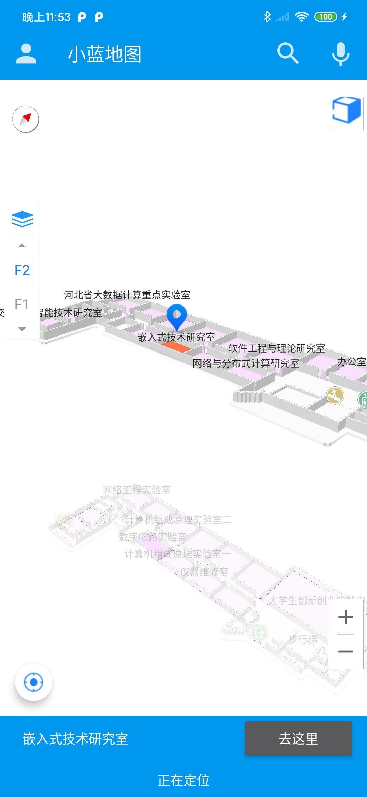
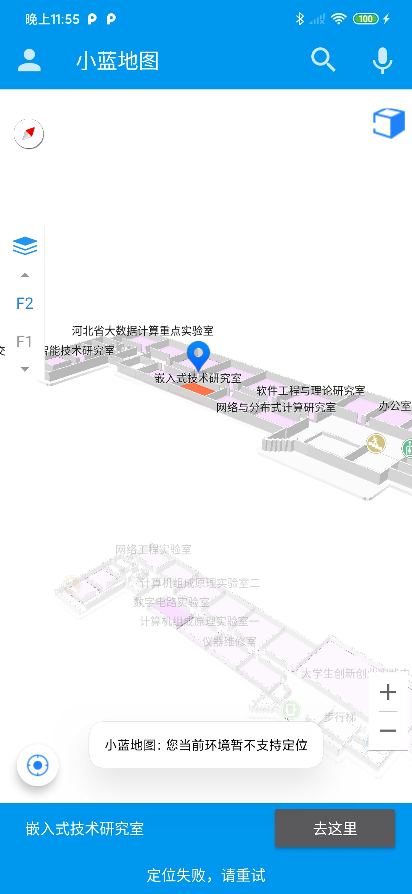
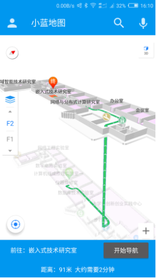
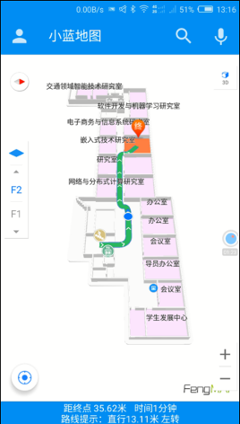
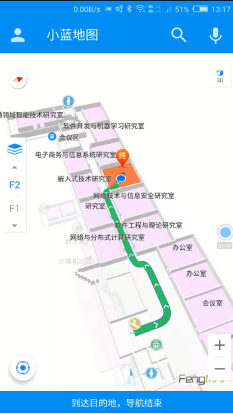

# Indoor navigation 室内导航

## 功能
1. 基于iBeacon通信协议的定位功能（需要环境支持，测试环境已拆除）
2. 路线规划功能，通过地图选点确定目的地，生成当前位置前往目的地的路线
3. 导航跟随，可选择第一人称或第三人称导航跟随，动态更新当前位置（同样需要环境支持）
3. 语音导航，集成了科大讯飞的语音SDK，能够实现语音播报路线信息

## 界面
主界面（单楼层）：

主界面（多楼层）：

点击定位按钮，开始定位，扫描附近的iBeacon信号，预处理后上传服务器：

定位失败提示，由于扫描到0个iBeacon（小于5个），提示定位失败，当前环境不支持定位：

定位成功，后台计算后返回用户当前位置，选择目的地后开始导航（找到以前资料中的图片，清晰度有问题）：

导航中，实时更新位置，并语音播报路线提示信息：

到达目的地：

## 使用方法
本项目使用了[蜂鸟云](https://cloud.fengmap.com/)作为地图引擎，需要添加‘安全SHA1’到蜂鸟云控制台才能正常运行。具体方法请参考蜂鸟云相关文档。

本项目现已兼容Android 11 和 Android Studio 4.1 (2020/11/18)